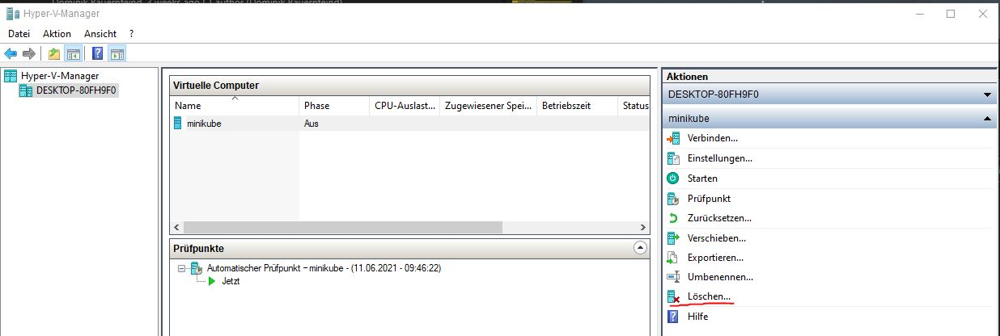
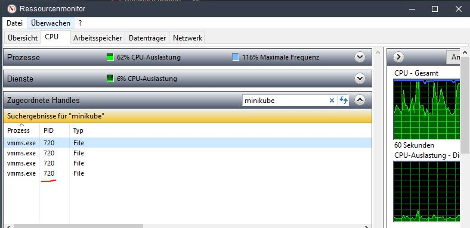
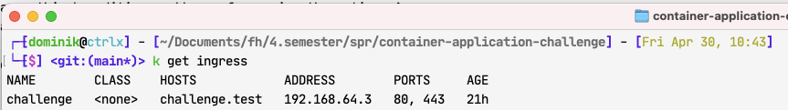

# container-application-challenge
SPR4G1 Studienprojekt für gepardec

## How to start REST API with HAProxy
1. Run `mvnw package -DskipTests` in ./app
2. Run `docker-compose up --build` in root directory
3. Import the self-signed ssl certificate on your local system
    - [Windows](https://support.securly.com/hc/en-us/articles/360026808753-How-to-manually-install-the-Securly-SSL-certificate-on-Windows)
    -  [MacOS](https://superuser.com/questions/1359755/trust-self-signed-cert-in-chrome-macos-10-13)
    - [Linux](https://tarunlalwani.com/post/self-signed-certificates-trusting-them/)
4. The application is now running under [https://localhost:443](https://localhost:443)
5. If the backend has not changed, running `docker-compose up` is enough

## Instructions for Docker Image Registry

[docs/Working-With-The-Image-Registry.md](docs/Working-With-The-Image-Registry.md)

## Setup Kubernetes local environment

Use `minikube` to start a local kubernetes cluster by running `minikube start`.

---
**NOTE**


Use `minikube start --driver=hyperv` on Windows or `minikube start --driver=hyperkit` on MacOS, as there are some limitiations to the network driver of docker. (See [Issue #7332](https://github.com/kubernetes/minikube/issues/7332))

If you don't have Hyper-V enabled, see [the Microsoft documentation](https://docs.microsoft.com/en-us/virtualization/hyper-v-on-windows/quick-start/enable-hyper-v) for a guide on how to enable it.

If you had previously set up a local cluster with minikube, you might need to delete it with `minikube delete`. Please be aware that this is a __permanent deletion__.

If `minikube delete` throws a FILE_IN_USE error you will need to manually delete the Hyper-V server and kill the services which are locking minikube files.




To stop the processes use `taskkill /F /PID <PID_NUMBER>`

After deleting both the Hyper-V server and the locking tasks it is necessary to use `minikube delete --purge` to completely delete all existing minikube files.

---

### Ingress and SSL

We want an Ingress Control Pod to be available, so enable the minikube addon

```bash
minikube addons enable ingress

# Verify that the nginx-controller pod is available
kubectl get pods --namespace ingress-nginx
# or if you dont have namespaces, check for a pod called 'ingress-controller'
kubectl get pods -A
```

Disable verfication of TLS CA to allow a self-signed certificate (See [Issue #5401](https://github.com/kubernetes/ingress-nginx/issues/5401#issuecomment-662424306))
```bash
kubectl delete -A ValidatingWebhookConfiguration ingress-nginx-admission
```

Apply the ingress configuration
```bash
kubectl apply -f ingress.yaml
```

Add the SSL certificate as kubernetes secret type _tls_
```bash
kubectl create secret tls challenge-test-tls --key ha-proxy/server.key --cert ha-proxy/server.crt
```


### Start the database and application

---
**NOTE**

The cluster uses Docker images provided by our [image registry on Github](https://github.com/aeisl/container-application-challenge/packages). If you want to update versions of those images, follow the [instructions](docs/Working-With-The-Image-Registry.md).

---

```bash
kubectl apply -f github-registry-secret.yaml # Allows for pulling private Docker images
kubectl apply -f .\database-credentials.yaml # Applies database secrets
kubectl apply -f api.configmap.yaml # Applies config map for api 
kubectl apply -f database.service.yaml -f database.deployment.yaml
kubectl apply -f api.service.yaml -f api.deployment.yaml
kubectl apply -f database.volume.yaml -f database.claim.yaml
```

### Finshing the setup

Find out the external IP of your ingress by running `kubectl get ingress`. It should look something like this:



Create a DNS entry on your system (this may need administrative access on your system)
```bash
# For Linux or Mac
echo "192.168.64.3 challenge.test" >> /etc/hosts

# On Windows PowerShell use
echo "192.168.64.3 challenge.test" | Out-file -append -encoding ascii $env:windir\system32\drivers\etc\hosts
```

Querying the API should now work:
 
 ```bash
 curl -L -v http://challenge.test/missions

 Invoke-RestMethod -method "GET" -Uri "https://challenge.test/missions"
 ```

Register Login Test Query in Vagrant with curl:
```bash
curl -X POST -d "codeName=123&name=test" https://challenge.test/register -v -H 'content-type: application/x-www-form-urlencoded'                                           
curl -X POST -d "codeName=123" http://challenge.test/login -H 'content-type: application/x-www-form-urlencoded' -L -i  
```
