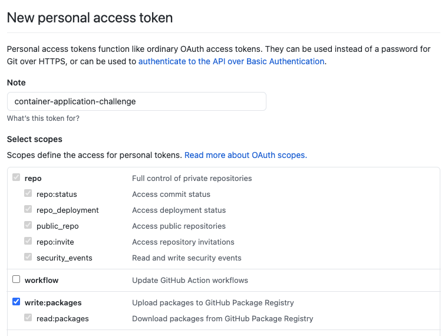
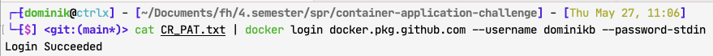

# Working with the Image Registry

## Create your Access Token

Create your own Personal Access Token (PAT) by following the [official instructions](https://docs.github.com/en/github/authenticating-to-github/keeping-your-account-and-data-secure/creating-a-personal-access-token
). Give it the permission to __write:packages__.




## Connect to the Image Registry

To use the Github Image Registry with Docker you first must authenticate yourself.

````
echo "<yourtoken>" > CR_PAT.txt

# Linux and Mac
cat CR_PAT.txt | docker login docker.pkg.github.com --username USERNAME --password-stdin

# Windows
get-content CR_PAT.txt | docker login docker.pkg.github.com --username USERNAME --password-stdin
````

It should give you a success response.



If not, check that the file contains the correct token or create a new one if you are not sure about the tokens validity.

---

## Example(s) for publishing/using images

### Database 

Run the latest published version from the image registry.
````
docker run -e POSTGRES_PASSWORD=password docker.pkg.github.com/aeisl/container-application-challenge/database:latest
````

Build and publish a new latest version of our database image
````
docker build -t spr/postgres db/postgres
docker tag spr/database docker.pkg.github.com/aeisl/container-application-challenge/database:latest
docker push docker.pkg.github.com/aeisl/container-application-challenge/database:latest
````

### API (Quarkus)

Run the latest published version from the image registry.
````
docker run docker.pkg.github.com/aeisl/container-application-challenge/api:latest
````

Build and publish a new latest version of our api image
````
build -t spr/api -f app/src/main/docker/Dockerfile.jvm app
docker tag spr/api docker.pkg.github.com/aeisl/container-application-challenge/api:latest
docker push docker.pkg.github.com/aeisl/container-application-challenge/api:latest
````