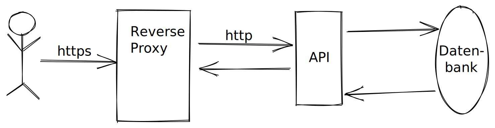

# Docker-Compose Setup

## Vorbereitung und Infos

- Um Ihr Setup überprüfen zu können folgen Sie den Anweisungen unter __"How to start REST API with HAProxy"__ in der [README.md](./README.md). Nach dem Abschluss des Tutorials sollten Sie beim Aufruf des Servers den Code 503 erhalten.
- Wenn docker-compose Fehlschlägt -> container löschen, Docker neustarten und README Schritt 1 und 2 erneut durchführen.
- Um Probleme zu verhindern, sollte der Container nach jeder Aufgabe gelöscht und neu gebuildet werden.

## Mission Teil 1

> Willkommen, Agent!
> 
> Hier startet Ihre erste Trainings-Mission. Wir beginnen wir mit einer Aufgabe zu [docker-compose](https://docs.docker.com/compose/).
> 
> Sie arbeiten dabei auf einer Testinstanz unseres **Agenten-Verwaltung-Systems**. Es speichert und verwaltet unsere Agenten sowie deren Missionen in einer Datenbank und ermöglicht den Zugriff über eine REST-API.
> Damit ein sicherer Zugriff möglich ist, verwenden wir einen Reverse-Proxy zur Terminierung von SSL Verbindungen, der Aufrufe anschließend an unsere API weiterleitet.

- Ihre erste Aufgabe besteht darin, den Java API Server erreichbar zu machen. Stellen Sie dafür beim docker-compose File den richtigen Backend-Port für die API ein. Sie finden diesen in der haproxy.cfg ([ha-proxy/haproxy.cfg]()) und machen Sie diesen von dem Port 80 von außen erreichbar. (<https://www.haproxy.com/de/blog/the-four-essential-sections-of-an-haproxy-configuration/>) 
Zum Testen rufen Sie `curl -L "http://localhost:80/missions"` auf. Der Aufruf sollte ein leeres Ergebnis enthalten.

> Sehr gut, Agent. Die erste Hürde haben Sie gemeistert.
> 
> Sie verstehen sicherlich, dass Sicherheit für unsere Agenten unsere höchste Priorität hat. Stellen Sie daher sicher, dass jede Kommunikation verschlüsselt stattfindet, auch wenn sie versehentlich unverschlüsselt begonnen wird.

Implementieren Sie einen http auf https redirect für den HAProxy auf dem port 443. Passen Sie dafür die HAProxy Konfigurationen an ([/ha-proxy/haproxy.cfg](../../ha-proxy/haproxy.cfg)).

Zum Testen rufen Sie `curl -L "http://localhost:80/missions"` mit ihrem Browser auf. Sie sollten automatisch auf eine https Verbindung umgeleitet werden. (<https://www.haproxy.com/de/blog/redirect-http-to-https-with-haproxy/>)

> Nun, da Sie eine sichere Verbindung garantiert haben, können wir endlich Daten über unsere Agenten und Missionen ausliefern.

Als letzte Trainingseinheit sollen Sie Daten auf dem Server anzeigen lassen. Verwenden sie dafür die im Pfad ([/db/postgres/initdb](../../db/postgres/initdb)) vorhandenen SQL-Scripts.

Die Testdaten sollen automatisch eingespielt werden, wenn die Datenbank das erste Mal gestartet wird. (<https://onexlab-io.medium.com/docker-compose-postgres-initdb-ba0021deef76>)

Zum Testen rufen Sie abermals `curl -L "http://localhost:80/missions" | jq` auf. Nun sollten Sie die Missionsdaten der Datenbank angezeigt bekommen.

> Ausgezeichnet!
> 
> Sie haben die Einführung gemeistert und sind bereit unser Produktivsystem zu konfigurieren.
